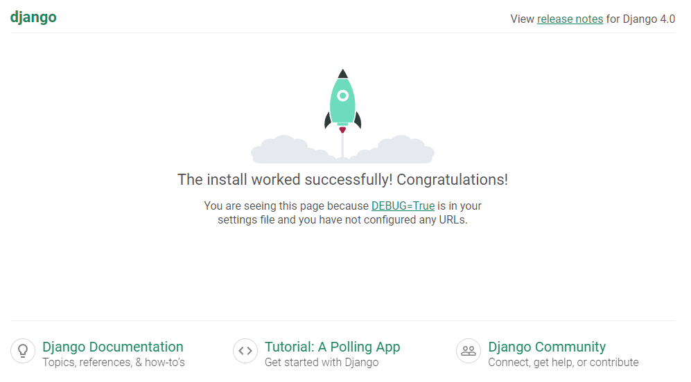

# Writing  your first Django App

- note: We assume that you have Django already installed.  We verify this by the code below and you command line should print the the django version in your machine. Else, see this [link](https://www.djangoproject.com/download/) for the installation guide.

```python
python -m django --version
```

1. Create a project

    - Create a folder where we will put all of the project files. Open the folder in your command line and then type the text below.

    ```python
    # django-admin startproject <your desired project name>
    django-admin startproject my_first_app
    ```

2. Verify if your initial set up works fine.

    ```python
    python manage.py runserver
    ```

    You should see something like this:

    ```python
    Performing system checks...

    System check identified no issues (0 silenced).

    You have unapplied migrations; your app may not work properly until they are applied.
    Run 'python manage.py migrate' to apply them.

    July 27, 2022 - 15:50:53
    Django version 4.0, using settings 'mysite.settings'
    Starting development server at http://127.0.0.1:8000/
    Quit the server with CONTROL-C.
    ```

    And in your browser, go to https://127.0.0.1:8000/. You should see something similar to this:

    

    Alternatively, we can choose which port on your machine to run our app by the code below. Full documentation can be found [here](https://docs.djangoproject.com/en/4.0/ref/django-admin/#django-admin-runserver).
    
    ```python
    # python manage.py runserver <your desired port>
    python manage.py runserver 8080
    ```


